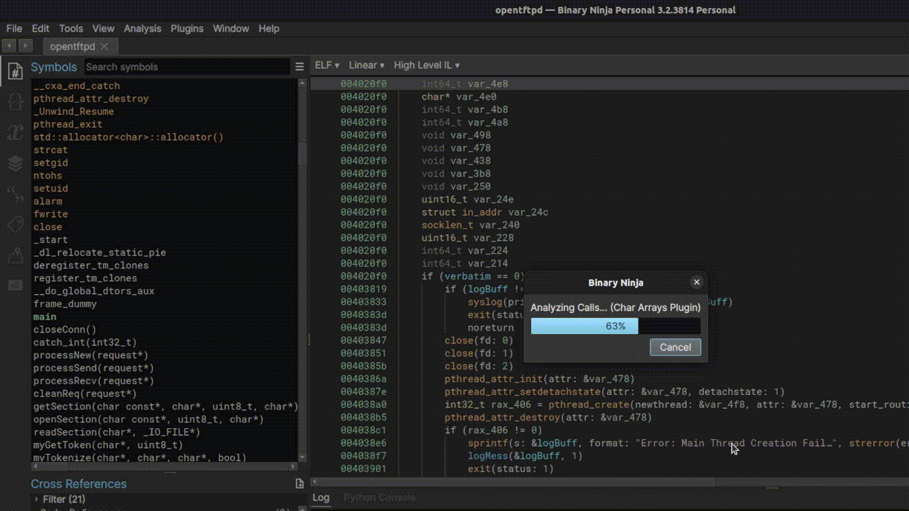
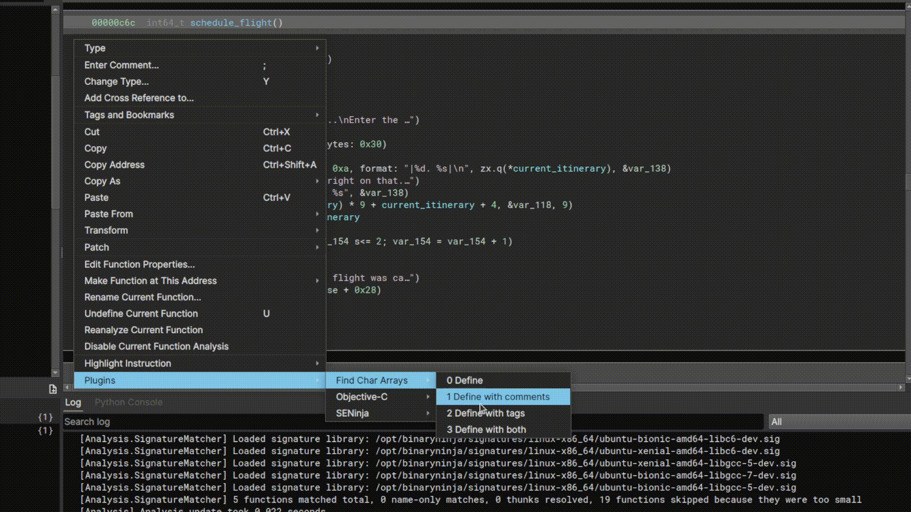

# Binary Ninja Char Arrays 
Author: **elbee**

Analyzes void variables and loads them as defined character arrays.

## Description:
Binary Ninja does not assume types to be character arrays and initializes them void. This plugin analyzes the selected function for character arrays and re-declares them as such, eg. (char buf\[size]). Allows buffers to be shown as is and not as void types for preference purposes.

In an attempt to cooperate with other architectures, the majority of checks are done with the medium level intermediate language and disassembly. Tested on CTF challenges from coorporate cyber challenges and https://pwnable.tw/challenge/.

To operate the plugin simply right click in your pane and select an option. The plugin can also mark newly defined character arrays with additional information in tags and/or comments.

## License

This plugin is released under an [MIT license](./LICENSE).
